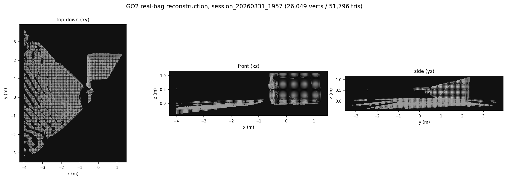

# Real GO2 rosbag reconstruction

First reconstruction from **real robot data** rather than Replica/ScanNet/synthetic.
Input is a recorded Unitree GO2 ROS 2 bag; output is a colored TSDF mesh.



## Result

- Source bag: `session_20260331_1957` (74 s, `/go2/camera/image_raw` rgb8,
  `/go2/camera/depth/image_raw` 32FC1 metric depth, `/tf`, `/tf_static`, `/odom`).
- 370 frames (stride 3), 4 cm voxel, reference backend, fused in 1.5 s on an
  NVIDIA Blackwell consumer GPU (245 FPS).
- Mesh: **26,049 verts / 51,796 tris**, extent 5.22 x 6.75 x 1.48 m.
- The side view resolves a floor plane and a wall-like vertical structure at
  correct metric scale, confirming pose + depth + intrinsics are consistent.
- Re-run end to end on 2026-07-03 after rebasing this work onto current
  `main`, to confirm the pipeline still reproduces. Numbers above are from
  that run (a ~0.1 s / 7 FPS difference from the original run is normal
  timing variance, not a regression).

## Honest caveats

- The robot mostly **rotated in place** (base translation ~30 cm); this is a
  local panoramic reconstruction of the surroundings, not a traversal map.
- Vertex colors are washed toward gray: the indoor scene is low-texture and the
  camera RGB is dim. Geometry is sound; appearance is not a showcase.
- Depth beyond 8 m is dropped as spurious far returns.
- Nothing is injected or synthetic here: every pixel and pose is real hardware.

## Reproduce

Two stages, deliberately decoupled so the fusion stays ROS-free (offline-first):

```bash
# 1. ROS side (needs a sourced ROS 2 Humble; reads the .db3, resolves pose via tf2)
source /opt/ros/humble/setup.bash
python scripts/bag_to_frames.py <bag_dir> <frames_out> 3   # stride 3

# 2. Torch side (project venv; no ROS needed)
python scripts/reconstruct_from_frames.py <frames_out> go2_room_recon.ply 0.04
```

`bag_to_frames.py` emits a Replica-style folder (`rgb/*.png`, `depth/*.npy`
float32 meters, `traj.txt` of 4x4 cam->odom poses, `intrinsics.txt`). Pose is a
tf2 lookup of `odom -> camera_color_optical_frame` at each color-image stamp;
depth is already registered to the color optical frame, so no alignment step.

## Next

- Open-vocab grounding (SAM-dense CLIP) on this real map is untested; the RGB is
  dim, so grounding quality is an open question.
- A traversal bag (real base motion) would give a proper map rather than a
  rotation panorama.
